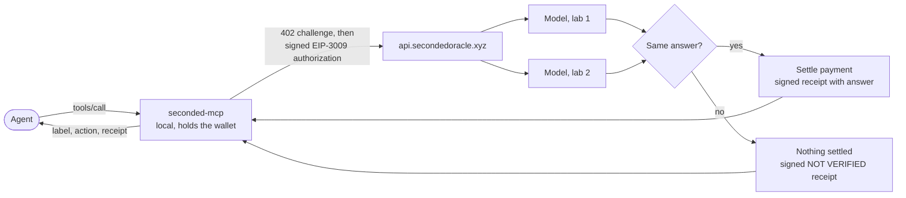

<div align="center">

<picture>
  <source media="(prefers-color-scheme: dark)" srcset="assets/readme-hero-dark.png">
  <source media="(prefers-color-scheme: light)" srcset="assets/readme-hero-light.png">
  
</picture>

**An AI agent pays per check over x402. Two models from rival labs must agree. Every answer carries an Ed25519-signed receipt. No answer, no charge.**


</div>

---

SECONDED is a paid second opinion for autonomous agents. Before an agent signs a
transaction, trusts a token, pays another agent or acts on a message, it sends the exact
input to SECONDED and gets back one answer label and the action that label maps to. The
answer counts only if two models from different labs reached it independently; otherwise
the agent is told to pause and nothing is charged. Every response, including refusals, is
signed, and anyone can verify the signature offline with the code in this repository.

This repository is the public, buildable surface: the Go MCP client, a standalone receipt
verifier, the shipped tool and price catalogs, and the documentation. The service that
runs the checks is not here; see [What this repository does not contain](#what-this-repository-does-not-contain).

## Check it yourself

Every sentence above maps to something you can run or look at. In order of effort:

1. **Verify a production-signed receipt offline.** No account, no network, one command:
   ```sh
   cd verifier && go run ./cmd/seconded-verify testdata/refused-base-mainnet-2026-10-06.json
   ```
   ```text
   OK    testdata/refused-base-mainnet-2026-10-06.json
         signature   Ed25519 by rk-2026-09-a over receipt v1 (807 canonical bytes)
         state       refused: the request was refused before admission; nothing charged
         product     null   check_id null   issued_at 2026-10-06T03:57:35.018936Z
         checked_by  none named
         billing     charged=no settlement=none network=eip155:8453 amount_atomic=null tx=null
   ```
   That receipt was signed by the live service on 2026-10-06 while refusing a request.
   Change a byte and it fails ([examples/verify-receipt](examples/verify-receipt/)).
2. **Read the live catalog and compare it with the committed capture.**
   `curl -s https://api.secondedoracle.xyz/v1/products | jq '.networks, [.products[].id]'`
   versus [`client/products-live-v1.json`](client/products-live-v1.json), captured 2026-09-30.
3. **Compare the live receipt key with the compiled pin.**
   `curl -s https://api.secondedoracle.xyz/v1/keys` must list `rk-2026-09-a` as
   `438d9301c477c27fecc3f56da0a7d5a6b3894cef69815bae63b5349dc2cddf0b`, the value in
   [`client/receipt.go`](client/receipt.go) and [`verifier/keys.go`](verifier/keys.go).
4. **Look at the pay-to address on chain.** Checks settle to
   `0x010ab46d566cde25cca0ee55eb105e781c7bcf3a` on Base (`eip155:8453`, USDC), Arc
   (`eip155:5042`, USDC) and Robinhood Chain (`eip155:4663`, USDG). On Base:
   https://basescan.org/address/0x010ab46d566cde25cca0ee55eb105e781c7bcf3a
5. **Build the client from vendored source with the network switched off.**
   ```sh
   cd client && GOPROXY=off go build -o seconded-mcp ./cmd/seconded-mcp && ./seconded-mcp --version
   ```
   prints `seconded-mcp 0.4.1`.

[`docs/CLAIMS.md`](docs/CLAIMS.md) lists every claim in this README with its evidence and
how it was checked.

## Quickstart

Two commands. The first proves the receipt path; the second builds the client and prints
the line that connects it to Claude Code (`claude-desktop`, `cursor`, `codex`, `gemini`
and `generic` work the same way).

```sh
cd verifier && go run ./cmd/seconded-verify testdata/refused-base-mainnet-2026-10-06.json
cd ../client && go build -o seconded-mcp ./cmd/seconded-mcp && ./seconded-mcp host-snippet --host claude-code
```

To actually buy checks the client needs a wallet, which `seconded-mcp setup` creates, and
a few dollars of USDC on Base. Source builds pass their own digest to setup because no
signed release manifest exists yet. The whole path, including limits and recovery, is in
[docs/guide/install.md](docs/guide/install.md).

## Which path do I need?

| You are | Start here |
| --- | --- |
| Building an agent that should stop before doing something expensive | [Install and run](docs/guide/install.md), then [Tools reference](docs/guide/tools.md). |
| Auditing a receipt someone showed you | [`verifier/`](verifier/) and [Receipts and verification](docs/guide/receipts.md). |
| Integrating over HTTP without the Go client | The public routes are `GET /v1/products`, `POST /v1/quote`, `POST /v1/x402/checks`, `GET /v1/checks/{check_id}`, `GET /v1/keys`, `GET /v1/health`, `GET /v1/openapi.json` at `https://api.secondedoracle.xyz`. The client source is the reference implementation of the payment door. |
| Judging or reviewing the project | This repository plus the private repository described in [the Colosseum note](#colosseum). |

## How a check works



1. The agent calls one tool with structured input, never prose. Inputs are bounded and
   priced by size tier.
2. The client posts to the x402 door, gets a 402 challenge, compares the challenge's
   `payTo` with the pinned catalog address, and signs an EIP-3009 authorization with the
   dedicated wallet. Spending limits are enforced before signing.
3. The service gives the same evidence to two models from different labs. For on-chain
   facts, two independent RPC readers must agree at one pinned block first.
4. If both models agree and the answer is saved, the authorization is settled and the
   receipt carries the answer label and the settlement transaction. If not, the receipt
   says `NOT VERIFIED`, tells the agent to pause or ask a human, and nothing is settled.
5. The client verifies the receipt under the compiled key pin and binds it to the
   purchase it made. The catalog's `answer_to_action` map, not the model, says what the
   label means: `proceed`, `STOP and show the owner`, or `pause or ask a human`.

Details, timeouts and recovery: [docs/guide/how-it-works.md](docs/guide/how-it-works.md).

## Products, prices, coverage

Twelve paid checks in the 0.4.1 catalog, six utility tools, and seven free local privacy
tools still in testing. Prices are USD per check; the checks marked ¹ cost $0.15 when paid
on Robinhood Chain.

| Check | Tool | Small | Medium | Large | Live? |
| --- | --- | ---: | ---: | ---: | --- |
| Trade Check | `seconded_trade_check` | 0.25 | 1.50 | — | ✓ |
| Stock Token Check | `seconded_stock_token_check` | 0.10 ¹ | — | — | ✓ ² |
| Token Check | `seconded_token_check` | 0.10 ¹ | — | — | ✓ ² |
| Agent Registry Check | `seconded_agent_registry_check` | 0.25 | — | — | ✓ |
| Address Screening Check | `seconded_counterparty_check` | 0.10 ¹ | — | — | ✓ ² |
| Cross-Chain Compare | `seconded_cross_chain_compare` | 0.10 ¹ | — | — | ✓ ² |
| Scam Check | `seconded_scam_check` | 0.10 ¹ | 1.50 | 2.50 | ✓ ² |
| Lending Check | `seconded_lending_check` | 0.25 | — | — | not yet ³ |
| Agent Work Payout Check | `seconded_job_escrow_check` | 0.25 | — | — | not yet ³ |
| x402 Payment Check | `seconded_x402_payment_check` | 0.10 ¹ | — | — | not yet ³ |
| Shielded Route Check | `seconded_shielded_route_check` | 0.25 | — | — | not yet ³ |
| Bridge Route Check | `seconded_route_check` | 0.10 ¹ | — | — | not yet ³ |

✓ listed in the live catalog captured 2026-09-30. ² The capture shows $0.25 for these;
the lower price applies to clients 0.4.0 and newer, and no 0.4.x client is released yet.
³ In the shipped catalog but not in the 2026-09-30 capture; on 2026-10-06 the production
API refused `shielded_route_check` as `unknown_product` (that refusal is the verifier
fixture). Six more products (Vault Check, Private Receive Scan, Portfolio Check, Code
Review, Owner Instruction Check, Hidden Prompt Check) are `in_testing` and cannot be
bought. Subject chains per check, tiers, payment networks and the privacy tools:
[docs/guide/pricing-and-coverage.md](docs/guide/pricing-and-coverage.md).

## Verify a receipt

A receipt is `{"envelope": {...}, "sig": "...", "key_id": "rk-2026-09-a"}`. The signature is
Ed25519 over `"SECONDED-RECEIPT/v1\x00"` (or `v2`, `v3`) followed by the envelope in RFC 8785
canonical form. The verifier in [`verifier/`](verifier/) reproduces that check with no
dependencies outside the Go standard library and a vendored copy of the canonicalizer, and
reports the state, the labs named in `checked_by`, the billing block and the settlement
transaction. It makes no network calls.

```sh
cd verifier && go run ./cmd/seconded-verify -json your-receipt.json
```

What the verifier checks, what only the paying client can check, and the receipt fields:
[docs/guide/receipts.md](docs/guide/receipts.md).

## Release verification

No binary release has been published as of 2026-10-06. When one is, it ships
`SHA-256SUMS` and an OpenSSH Ed25519 signature over it, verified with
`ssh-keygen -Y verify` against a publisher key announced at https://secondedoracle.xyz
and on @SecondedOracle. The client's own `setup` repeats that verification before it
creates a wallet. The procedure, the asset names and the planned channels (npm, Homebrew,
the MCP Registry, Smithery) are fixed now: [docs/guide/release-verification.md](docs/guide/release-verification.md).

## Status

| Component | State on 2026-10-06 | Evidence |
| --- | --- | --- |
| Public API at `api.secondedoracle.xyz` | Live on Base, Arc and Robinhood Chain mainnets; seven paid checks listed | `client/products-live-v1.json` (2026-09-30); the signed refusal of 2026-10-06 |
| Client source | 0.4.1, builds and passes its shipped tests; unsigned, unreleased | `client/api.go`, CI workflow, [CLAIMS](docs/CLAIMS.md) |
| Receipt verifier | Builds; verifies the production fixture; 8 tests | `verifier/receipt_test.go` |
| Five 0.4.x checks | In the catalog, not observed live | footnote ³ above |
| Six products | In testing, not purchasable | `client/products.json`, `unavailable_products` |
| Seven privacy tools | In testing, free, local | `client/privacy-tools.json` |
| Binary releases, npm, Homebrew, registry listings | None published | [release-verification](docs/guide/release-verification.md) |
| Licence | Not chosen | see below |

## What this repository does not contain

- The API server, the settler, the worker, and the judge prompts.
- Judging thresholds, allowlists, model configuration, infrastructure, deployment, and
  operations material.
- QA and audit records, and customer trial data.
- The client's internal test fixtures that depend on private golden vectors. The client
  ships with 22 of its test files; the rest run in the private repository.
- A developer-only Python companion for the privacy tools, which the default build
  excludes anyway.

The client talks to the production service only. Nothing here lets you run your own
SECONDED.

## Honest limits

- Two rival-lab models agreeing is evidence, not proof. That is why every answer maps to
  an action and a NOT VERIFIED path exists. Nothing here is financial advice or a
  guarantee, and the receipt's `disclaimer` field says so for financial products.
- The client wallet is a hot wallet on your machine. Spending limits are enforced by the
  client, not on chain. Keep only what you intend to spend in it.
- Coverage is narrow by design: each check reads specific facts from two readers at one
  block. The catalog's `coverage` text says what was not checked; a no-match is never
  proof of safety.
- Latency, throughput and uptime are not published here because they have not been
  measured in a way we would stand behind.
- The pricing above is what the catalog says. The live service decides what it sells to
  which client version; the capture and the refusal fixture are the two data points we
  have, and both are in the tree.

## Colosseum

This repository is SECONDED's public showcase and trust surface. The full development
history and the server source are shared privately with the Colosseum judges through a
separate repository; that private repository is the submission link. Everything a third
party can check without server access is here.

## Contributing, security, licence

- [CONTRIBUTING.md](CONTRIBUTING.md): what we take and how to build.
- [SECURITY.md](SECURITY.md): report to support@secondedoracle.xyz with `SECURITY` in the
  subject.
- Licence: **none chosen yet**, so the default applies and all rights are reserved until
  a `LICENSE` file is added. The maintainers intend to choose one before the first
  binary release.
- [CHANGELOG.md](CHANGELOG.md) records what each client version changed.
