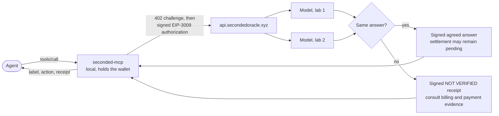

<div align="center">

<picture>
  <source media="(prefers-color-scheme: dark)" srcset="assets/readme-hero-dark.png">
  <source media="(prefers-color-scheme: light)" srcset="assets/readme-hero-light.png">
  
</picture>

**An AI agent pays per check over x402. Two models from rival labs must agree. Every answer carries an Ed25519-signed receipt. No answer, no charge.**


[](LICENSE)
[](https://github.com/SecondedOracle/seconded/actions/workflows/ci.yml)

</div>

---

SECONDED is a paid second opinion for autonomous agents. Before an agent signs a
transaction, trusts a token, pays another agent or acts on a message, it sends the exact
input to SECONDED. An agreed answer carries a label and its mapped action; pending,
refused, failed or NOT VERIFIED results mean pause. The service requires usable
agreement between OpenAI and Anthropic models before settlement. Receipt signatures
authenticate what the service reports, not independent proof that the models are correct.

Check receipts, including signed refusal receipts, authenticate their canonical
envelope. Public metadata, payment challenges, and some transport or validation
errors are not signed receipts. The offline verifier checks the receipt signature;
it does not establish the truth of the models' work or unsigned wrapper fields.

This repository is the public, buildable surface: the Go MCP client, a standalone receipt
verifier, the shipped tool and price catalogs, and the documentation. The service that
runs the checks is not here; see [What this repository does not contain](#what-this-repository-does-not-contain).

This checkout reports client version 0.4.1. Its baseline was development snapshot
`ff16198c799c7d2b6b3dafb32e847168249b033d`, with a sanitized vendor-patch note and
subsequent public corrections. The public modules now use
`github.com/SecondedOracle/seconded/client` and `github.com/SecondedOracle/seconded/verifier`.
Renaming the module paths changes build digests; this tree is not byte-identical to
release source. Published binaries are built from the private release source named in
[build information](https://github.com/SecondedOracle/seconded-mcp-releases/releases/download/v0.4.1/build-info.json),
`b8cfd7d1375d4f3a65087410a4a600e081e715bc`, and are verified against the signed release
manifest. The module rename is the only executable-source change in this update;
the earlier snapshot differences remain. Tests here apply to this checkout, with no
claim that its binaries match published release digests.

## Check it yourself

The checks below reproduce key public claims; [CLAIMS.md](docs/CLAIMS.md) separates
measured facts, source-backed behavior and maintainer statements. In order of effort:

1. **Verify public PAID and NOT VERIFIED receipts offline.** The
   [official example receipts](https://secondedoracle.xyz/docs#example-receipts) are
   committed under [`verifier/testdata`](verifier/testdata/). No account or purchase:

   ```sh
   cd verifier && go run ./cmd/seconded-verify testdata/trade-paid-base-mainnet-2026-09-29.json testdata/token-not-verified-base-sepolia-2026-09-29.json
   ```

   The Trade Check signs `charged=yes`, `amount_atomic=250000` ($0.25), and
   [this Base transaction](https://basescan.org/tx/0x9472572e3cfe100973002a46b1d943a97ca3839be0c834863654d4a4e4fa1b13).
   The Token Check signs `state=no_agreement`, `charged=pending` and `tx=null`.
   These are public issuer assertions; chain inclusion/finality was not independently
   queried. The Token sample checks a Base Sepolia subject while billing names Base
   mainnet. Both receipts name OpenAI and Anthropic and use receipt version 3.

   The historical refusal remains a smaller smoke test:

   ```sh
   cd verifier && go run ./cmd/seconded-verify testdata/refused-base-mainnet-2026-10-06.json
   ```

   ```text
   OK    testdata/refused-base-mainnet-2026-10-06.json
         signature   Ed25519 by rk-2026-09-a over receipt v1 (807 canonical bytes)
         state       refused: request refused before admission; consult signed billing and payment evidence
         product     null   check_id null   issued_at 2026-10-06T03:57:35.018936Z
         checked_by  none named
         billing     charged=no settlement=none network=eip155:8453 amount_atomic=null tx=null
   ```

   That receipt was signed by the live service on 2026-10-06 while refusing a request.
   Changing a signed envelope value invalidates the signature. Whitespace, key ordering
   and unsigned outer reply fields are not authenticated as file bytes.
   See [examples/verify-receipt](examples/verify-receipt/).
2. **Read the live catalog and compare it with the committed capture.**

   ```sh
   curl -fsS -H 'SECONDED-CLIENT-VERSION: 0.4.1' \
     https://api.secondedoracle.xyz/v1/products |
     jq '.networks, [.products[] | {id, price_usd, price_usd_by_network}]'
   ```

   versus [`client/products-live-v1.json`](client/products-live-v1.json), captured 2026-09-30.
3. **Compare the live receipt key with the compiled pin.**
   `curl -s https://api.secondedoracle.xyz/v1/keys` must list `rk-2026-09-a` as
   `438d9301c477c27fecc3f56da0a7d5a6b3894cef69815bae63b5349dc2cddf0b`, the value in
   [`client/receipt.go`](client/receipt.go) and [`verifier/keys.go`](verifier/keys.go).
4. **Look at the pay-to address on chain.** Checks settle to
   `0x010ab46d566cde25cca0ee55eb105e781c7bcf3a` on Base (`eip155:8453`, USDC), Arc
   (`eip155:5042`, USDC) and Robinhood Chain (`eip155:4663`, USDG). On Base:
   <https://basescan.org/address/0x010ab46d566cde25cca0ee55eb105e781c7bcf3a>
5. **Build the client from vendored source with the network switched off.**

   ```sh
   cd client && GOPROXY=off go build -o seconded-mcp ./cmd/seconded-mcp && ./seconded-mcp --version
   ```

   prints `seconded-mcp 0.4.1`. The module requires Go 1.26.6 or newer and selects
   Go 1.26.7; install or cache that toolchain before an offline build.

[`docs/CLAIMS.md`](docs/CLAIMS.md) records the principal claims, their evidence and measurement limits.

## Quickstart

After this repository is published, install either command from the public modules:

```sh
go install github.com/SecondedOracle/seconded/client/cmd/seconded-mcp@latest
go install github.com/SecondedOracle/seconded/verifier/cmd/seconded-verify@latest
```

The repository and its CI badge are prepared for publication; remote installation
and CI results are not available until it is published. For this local checkout:

Two commands. The first proves the receipt path; the second builds the client and prints
the line that connects it to Claude Code (`claude-desktop`, `cursor`, `codex`, `gemini`
and `generic` work the same way).

```sh
cd verifier && go run ./cmd/seconded-verify testdata/refused-base-mainnet-2026-10-06.json
cd ../client && go build -o seconded-mcp ./cmd/seconded-mcp && ./seconded-mcp host-snippet --host claude-code
```

To buy checks, setup creates a dedicated wallet that you fund for the selected
network. An ordinary build from this checkout has no publisher key or signed manifest
for its newly compiled bytes, so its source-build setup path requires an explicit
digest. Published binaries have their own signed release manifests. The whole path,
including limits and recovery, is in [docs/guide/install.md](docs/guide/install.md).

## Which path do I need?

| You are | Start here |
| --- | --- |
| Building an agent that should stop before doing something expensive | [Install and run](docs/guide/install.md), then [Tools reference](docs/guide/tools.md). |
| Auditing a receipt someone showed you | [`verifier/`](verifier/) and [Receipts and verification](docs/guide/receipts.md). |
| Integrating over HTTP without the Go client | Core public routes include `GET /v1/products`, `POST /v1/quote`, `POST /v1/x402/checks`, `GET /v1/checks/{check_id}`, `GET /v1/keys`, `GET /v1/health`, `GET /v1/openapi.json` at `https://api.secondedoracle.xyz`. The client source is the reference implementation of the payment door. |
| Judging or reviewing the project | This repository plus the private repository described in [the Colosseum note](#colosseum). |

## How a check works



1. The agent calls one tool with a typed JSON input object; message checks include prose
   inside its text field. Inputs are bounded and
   priced by size tier.
2. The client posts to the x402 door, gets a 402 challenge, compares the challenge's
   `payTo` with the pinned catalog address, and signs an EIP-3009 authorization with the
   dedicated wallet. Spending limits are enforced before signing.
3. The service gives the same evidence to two models from different labs. For on-chain
   facts, two independent RPC readers must agree at one pinned block first.
4. The service's policy is to settle only after usable agreement is saved. An agreed
   answer can be released while settlement remains pending; included and final receipts
   carry the corresponding transaction state. Without usable agreement, the agent
   receives NOT VERIFIED guidance and must pause. Read the signed billing fields:
   `pending` is not a certificate of nonpayment. The paying client uses independent
   chain evidence to resolve payment status.
5. The client verifies the receipt under the compiled key pin and binds it to the
   purchase it made. The catalog's `answer_to_action` map, not the model, says what the
   label means: `proceed`, `STOP and show the owner`, or `pause or ask a human`.

Details, timeouts and recovery: [docs/guide/how-it-works.md](docs/guide/how-it-works.md).

## Products, prices, coverage

Twelve paid checks in the 0.4.1 catalog, six utility tools, and seven free local privacy
tools still in testing. Prices are USD per check; the checks marked ¹ cost $0.15 when paid
on Robinhood Chain.

| Check | Tool | Small | Medium | Large | Advertised to client 0.4.1 on 2026-10-06? |
| --- | --- | ---: | ---: | ---: | --- |
| Trade Check | `seconded_trade_check` | 0.25 | 1.50 | — | yes |
| Stock Token Check | `seconded_stock_token_check` | 0.10 ¹ | — | — | yes |
| Token Check | `seconded_token_check` | 0.10 ¹ | — | — | yes |
| Agent Registry Check | `seconded_agent_registry_check` | 0.25 | — | — | yes |
| Address Screening Check | `seconded_counterparty_check` | 0.10 ¹ | — | — | yes |
| Cross-Chain Compare | `seconded_cross_chain_compare` | 0.10 ¹ | — | — | yes |
| Scam Check | `seconded_scam_check` | 0.10 ¹ | 1.50 | 2.50 | yes |
| Lending Check | `seconded_lending_check` | 0.25 | — | — | yes |
| Agent Work Payout Check | `seconded_job_escrow_check` | 0.25 | — | — | yes |
| x402 Payment Check | `seconded_x402_payment_check` | 0.10 ¹ | — | — | yes |
| Shielded Route Check | `seconded_shielded_route_check` | 0.25 | — | — | yes |
| Bridge Route Check | `seconded_route_check` | 0.10 ¹ | — | — | yes |

On 2026-10-06, `GET /v1/products` with `SECONDED-CLIENT-VERSION: 0.4.1` listed all
twelve checks at the prices shown here, including the Robinhood overrides. Without
that header it listed eight checks at legacy prices, including Lending at $0.50.
The committed 2026-09-30 capture is historical. The older quote-refusal fixture records
one refused request and cannot establish current availability; its outer
`unknown_product` reason is not covered by the receipt signature. These observations
verify the advertised catalog, not successful paid execution on every network.
The six unavailable products remain in testing and not purchasable.
Six more products (Vault Check, Private Receive Scan, Portfolio Check, Code Review,
Owner Instruction Check, Hidden Prompt Check) are `in_testing` and cannot be bought.
Subject chains per check, tiers, payment networks and the privacy tools:
[docs/guide/pricing-and-coverage.md](docs/guide/pricing-and-coverage.md).

## Verify a receipt

A receipt is `{"envelope": {...}, "sig": "...", "key_id": "rk-2026-09-a"}`. The signature is
Ed25519 over `"SECONDED-RECEIPT/v1\x00"` (or `v2`, `v3`) followed by the envelope in RFC 8785
canonical form. The verifier in [`verifier/`](verifier/) reproduces that check with no
dependencies outside the Go standard library and a vendored copy of the canonicalizer, and
reports the state, the labs named in `checked_by`, the billing block and the settlement
transaction. It makes no network calls.

```sh
cd verifier && go run ./cmd/seconded-verify -json your-receipt.json
```

What the verifier checks, what only the paying client can check, and the receipt fields:
[docs/guide/receipts.md](docs/guide/receipts.md).

## Release verification

Client 0.4.1 was published on 2026-10-06 as the npm package
[`@seconded/mcp`](https://www.npmjs.com/package/@seconded/mcp) and the GitHub release
[`SecondedOracle/seconded-mcp-releases` tag `v0.4.1`](https://github.com/SecondedOracle/seconded-mcp-releases/releases/tag/v0.4.1).
The release contains five native binaries, an MCPB bundle, build information,
`SHA-256SUMS` and its OpenSSH signature. Verify the signed manifest and the selected
artifact before running it. Release binaries are built from private release source
and verified by the signed manifest. This public tree uses renamed module paths,
which change build digests, and retains earlier development-snapshot differences;
see the source-provenance note in the [README](README.md).
See [release verification](docs/guide/release-verification.md) for the procedure.

## Status

| Component | State on 2026-10-06 | Evidence |
| --- | --- | --- |
| Public API at `api.secondedoracle.xyz` | Public GET endpoints reachable; three mainnet payment networks and twelve checks advertised to client 0.4.1; paid execution not exercised | Dated header-aware GETs in [CLAIMS](docs/CLAIMS.md) |
| Client source | Development snapshot reporting 0.4.1; source-built bytes differ from the published release | `client/api.go`, CI workflow, [CLAIMS](docs/CLAIMS.md) |
| Receipt verifier | Builds; verifies three public fixtures; parser and tamper controls | `verifier/receipt_test.go` |
| Version-dependent catalog | Twelve checks advertised to 0.4.1; eight without the header | Dated header-aware GETs |
| Six products | In testing, not purchasable | `client/products.json`, `unavailable_products` |
| Seven privacy tools | In testing, free, local | `client/privacy-tools.json` |
| Distribution | npm/GitHub 0.4.1; Registry 0.3.3 and older 0.3.0; expected public Homebrew tap not found in review; Smithery unverified | [release-verification](docs/guide/release-verification.md) |
| Licence | Apache-2.0 | [LICENSE](LICENSE), [NOTICE](NOTICE), [third-party licences](THIRD_PARTY.md) |

## What this repository does not contain

- The API server, the settler, the worker, and the judge prompts.
- Judging thresholds, allowlists, model configuration, infrastructure, deployment, and
  operations material.
- QA and audit records, and customer trial data.
- The client's internal test fixtures that depend on private golden vectors. The client
  ships with 22 of its test files; the rest run in the private repository.
- A developer-only Python companion for the privacy tools, which the default build
  excludes anyway.

The client talks to the production service only. Nothing here lets you run your own
SECONDED.

## Honest limits

- Two rival-lab models agreeing is evidence, not proof. That is why every answer maps to
  an action and a NOT VERIFIED path exists. Nothing here is financial advice or a
  guarantee, and the receipt's `disclaimer` field says so for financial products.
- The client wallet is a hot wallet on your machine. Spending limits are enforced by the
  client, not on chain. Keep only what you intend to spend in it.
- Coverage depends on the product. On-chain checks use agreeing readers at pinned
  blocks where specified; cross-chain comparison uses a block on each chain, message
  checks can be chain-independent, and list-only address screening uses no RPC reads.
  Consult the product's schema and any coverage text. Missing coverage or a no-match
  is not proof of safety.
- Latency, throughput and uptime are not published here because they have not been
  measured in a way we would stand behind.
- Prices and availability depend on client version. The local catalog and dated
  header-aware live observations are both inspectable; the September capture remains
  historical evidence.

## Colosseum

This repository is SECONDED's public showcase and trust surface. The full development
history and the server source are shared privately with the Colosseum judges through a
separate repository; that private repository is the submission link, according to the
maintainers. This repository provides the public client source snapshot, verifier and
catalog evidence; published releases and public example receipts are linked separately.
Access to the private judge submission is a maintainer statement.

## Contributing, security, licence

- [CONTRIBUTING.md](CONTRIBUTING.md): what we take and how to build.
- [SECURITY.md](SECURITY.md): report to <support@secondedoracle.xyz> with `SECURITY` in the
  subject.
- Code in this repository is licensed under [Apache-2.0](LICENSE); see [NOTICE](NOTICE).
  Vendored dependencies retain their own licences, listed in [THIRD_PARTY.md](THIRD_PARTY.md).
  This decision does not update previously published npm package metadata.
- SECONDED and the glass-S mark are trademarks of the maintainers; the licence covers the code, not the name or logo.
- [CHANGELOG.md](CHANGELOG.md) records what each client version changed.
