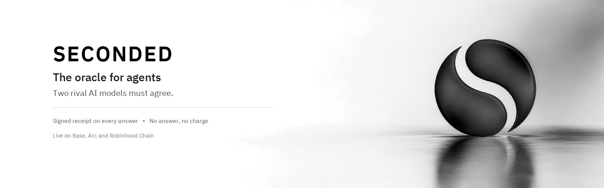

<div align="center">

<picture>
  <source media="(prefers-color-scheme: dark)" srcset="assets/readme-hero-dark.png">
  <source media="(prefers-color-scheme: light)" srcset="assets/readme-hero-light.png">
  
</picture>

**The oracle for agents: before an AI agent acts, two AI models from rival labs must agree, and every answer comes with a signed receipt; no answer, no charge.**


[](LICENSE)
[](https://github.com/SecondedOracle/seconded/actions/workflows/ci.yml)

</div>

---

SECONDED is the oracle for agents: before an AI agent acts, two AI models from rival labs must agree, and every answer comes with a signed receipt; no answer, no charge.

### Why it matters

- **Autonomous agents make high-stakes mistakes:** Before an AI agent signs a transaction, executes a trade, or trusts external input, it adds an independent check before the agent acts.
- **Rival-lab consensus reduces single-vendor blind spots:** Every check queries models from competing labs; agreement is required before an answer is accepted.
- **Signed receipts anyone can verify:** Every response carries an Ed25519-signed receipt over canonical JSON; if the models disagree or cannot verify the action, you receive a NOT VERIFIED receipt and are not charged.

---

## Try it

### 1. Install the MCP client

Install `@seconded/mcp` via npm or download prebuilt binaries from the releases repository:

- **npm:**
  ```sh
  npx @seconded/mcp --version
  ```
- **Releases repository:** Precompiled binaries and signed release manifests are available at [SecondedOracle/seconded-mcp-releases](https://github.com/SecondedOracle/seconded-mcp-releases).

To connect the client to Claude Code, Claude Desktop, Cursor, or Gemini, consult the [Installation guide](docs/guide/install.md).

### 2. Verify a receipt offline

You can verify signed receipts independently without an account, API key, or network access using the standalone verifier:

```sh
cd verifier && go run ./cmd/seconded-verify testdata/refused-base-mainnet-2026-10-06.json
```

The verifier checks the Ed25519 signature against the pinned key and prints the canonical envelope details:

```text
OK    testdata/refused-base-mainnet-2026-10-06.json
      signature   Ed25519 by rk-2026-09-a over receipt v1 (807 canonical bytes)
      state       refused: request refused before admission; consult signed billing and payment evidence
      product     null   check_id null   issued_at 2026-10-06T03:57:35.018936Z
      checked_by  none named
      billing     charged=no settlement=none network=eip155:8453 amount_atomic=null tx=null
```

You can also test with the committed paid trade check and token disagreement receipts:

```sh
cd verifier && go run ./cmd/seconded-verify testdata/trade-paid-base-mainnet-2026-09-29.json testdata/token-not-verified-base-sepolia-2026-09-29.json
```

See [docs/guide/receipts.md](docs/guide/receipts.md) for details on receipt structure and verification.

---

## For developers

This repository contains the buildable public surface: the Go MCP client, the standalone receipt verifier, tool and price catalogs, and documentation. For comprehensive technical details, see the guides below:

- **[How a check works](docs/guide/how-it-works.md):** The x402 payment flow, rival-model evaluation, and settlement policy.
- **[Receipts and verification](docs/guide/receipts.md):** Ed25519 signatures, RFC 8785 canonicalization, and verifying receipts offline.
- **[Tools reference](docs/guide/tools.md):** The 18 MCP tools exposed by client 0.4.2 and testing utilities.
- **[Pricing and coverage](docs/guide/pricing-and-coverage.md):** Catalog of 12 checks, payment networks (Base, Arc, Robinhood Chain), and pricing tiers.
- **[Install and run](docs/guide/install.md):** Building from source, setting up the dedicated wallet, and configuring spending limits.
- **[Security model](docs/guide/security-model.md):** Trust boundaries, hot wallet protections, and verification limits.
- **[Release verification](docs/guide/release-verification.md):** Verifying published release manifests and binary provenance.
- **[Claims register](docs/CLAIMS.md):** Principal claims, point-in-time evidence, and documented boundaries.

---

## Status

| Component | State on 2026-10-06 | Evidence |
| --- | --- | --- |
| Public API (`api.secondedoracle.xyz`) | Public GET endpoints reachable; 3 payment networks and 12 checks advertised | Dated header-aware GETs in [CLAIMS](docs/CLAIMS.md) |
| Client source | Development snapshot reporting 0.4.2; source-built bytes differ from published release | `client/api.go`, CI workflow, [CLAIMS](docs/CLAIMS.md) |
| Receipt verifier | Builds; verifies public fixtures; parser and tamper controls | `verifier/receipt_test.go` |
| Catalog | 12 checks advertised to client 0.4.2; 6 products in testing | Dated GETs, `client/products.json` |
| Distribution | npm (`@seconded/mcp`) and GitHub releases at 0.4.1; 0.4.2 source snapshot in this repository | [release-verification](docs/guide/release-verification.md) |
| Licence | Apache-2.0 | [LICENSE](LICENSE), [NOTICE](NOTICE) |

---

## Colosseum

This repository is SECONDED's public showcase and trust surface. The full development history and the server source are shared privately with the Colosseum judges through a separate private repository, which serves as the official submission link.

---

## Contributing, security, licence

- **Contributing:** See [CONTRIBUTING.md](CONTRIBUTING.md) for build instructions and submission guidelines.
- **Security:** Report security vulnerabilities to <support@secondedoracle.xyz> with `SECURITY` in the subject. See [SECURITY.md](SECURITY.md).
- **Licence:** Code in this repository is licensed under [Apache-2.0](LICENSE); see [NOTICE](NOTICE). Vendored dependencies retain their own licences, listed in [THIRD_PARTY.md](THIRD_PARTY.md).
- **Trademarks:** SECONDED and the glass-S mark are trademarks of the maintainers; the licence covers the code, not the name or logo.
- **Changelog:** [CHANGELOG.md](CHANGELOG.md) records changes across client releases.
