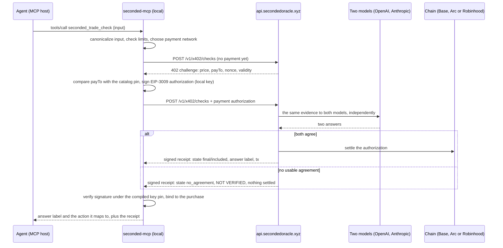

# How a check works

SECONDED answers one question for an AI agent: *may I act on this?* The agent sends a
bounded, typed input (an unsigned transaction, a token address, a message, an x402 offer),
pays a small fixed price over x402, and gets back a signed receipt. The answer is accepted
only if two models from rival labs agree on it; otherwise the receipt says NOT VERIFIED and
nothing is charged.

## Step by step

1. **The agent calls a tool.** Each paid check is one MCP tool, for example
   `seconded_trade_check`. The input is structured data, never prose: the exact unsigned
   transaction, the token address and network, the message text. Inputs are bounded and
   priced by size tier (small up to 8,192 bytes, medium up to 65,536, large up to 131,072;
   `client/products.json`, `tiers`).
2. **The client asks for a price.** It posts the input to the standard x402 door,
   `POST /v1/x402/checks`, and receives an HTTP 402 challenge naming the price, the asset,
   the `payTo` address and a validity window. Before signing anything it compares `payTo`
   with the address pinned in the shipped catalog for that network (`client/products.json`,
   `networks[].pay_to`).
3. **The client signs a payment authorization.** Payments use x402 v2 with the `exact`
   scheme: an EIP-3009 `transferWithAuthorization` signed by the dedicated check wallet.
   The private key never leaves the client. Spending limits (per check, per hour, per day,
   outstanding) are enforced before signing. Base mainnet in USDC is the default; Arc (USDC)
   and Robinhood Chain (USDG) are used only when the check names them.
4. **Two models check the same evidence.** The service gathers evidence (for on-chain
   facts, two independent readers must agree at one pinned block) and gives it to two
   models from different labs. Receipts record which labs under `checked_by`; the values the
   client accepts are `OpenAI` and `Anthropic` (`client/receipt.go`).
5. **Agreement settles the payment; disagreement does not.** If both models reach the
   same answer and it is saved, the authorization is settled and the receipt carries the
   answer label and the settlement transaction. If not, the receipt's state is
   `no_agreement`, its status is `not_verified`, its message is the exact text
   `NOT VERIFIED: no usable, verified agreement was reached. Do not act on this automatically; pause or ask a human.`
   and nothing is settled. The client does not take the server's word for non-payment:
   its own chain evidence certifies it (`closed_no_charge`).
6. **The client verifies the receipt.** Every receipt is Ed25519-signed under a key the
   client compiles in; see [Receipts and verification](receipts.md). The client also binds
   the receipt to the purchase it made (check id, request commitment, payer, amount) and
   maps the answer label to an action through the catalog's `answer_to_action`.

## What the agent is told to do

The catalog, not the model, decides what each label means. For Trade Check:

| Label | Action |
| --- | --- |
| `proceed` | Sign exactly the input that was checked. |
| `do_not_proceed` | STOP and show the owner. |
| `cannot_verify` | Pause or ask a human. |
| NOT VERIFIED | Pause or ask a human. |

Only an agreed signed receipt authorizes the listed next step, and only for the exact
input supplied. Pending, failed or NOT VERIFIED results mean pause
(`client/products.json`, `usage`).

## Timeouts and recovery

A tool call may wait up to 25 seconds (`wait_seconds`). If the answer is not ready, the
result carries a `check_id` and the agent calls `seconded_receipt` later; the purchase is
never repeated to collect the original result. The CLI equivalent is
`seconded-mcp recover --check-id ID`, which opens only the private ledger and the pinned
API and loads no wallet key. A paid check whose response was lost is still collected the
same way: you are charged only after both models agree and the answer is saved, and if
delivery fails you can always fetch it with `seconded_receipt`.

## Freshness

Agreed answers carry `data_as_of` (the oldest source date per dataset consumed) and
`data_freshness`, either `current` or `not_verified`, inside the signed answer. Fetching an
old answer again preserves its original dates; it does not acquire new evidence.

## What this is not

- Not financial advice, not an endorsement, not a guarantee. The catalog says so in the
  `disclaimer` the receipt carries for financial products.
- Not a trading, bridging or signing service. No check executes anything.
- Not a judgement about the owner's own rules or words; no launch check covers them.
